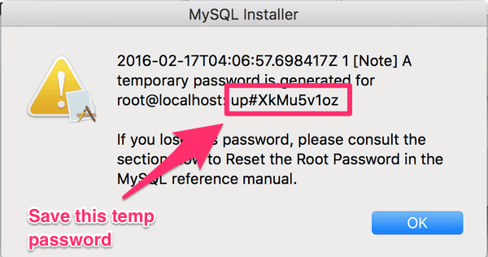
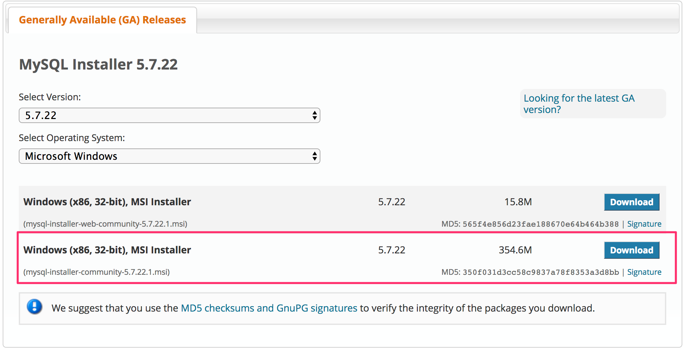
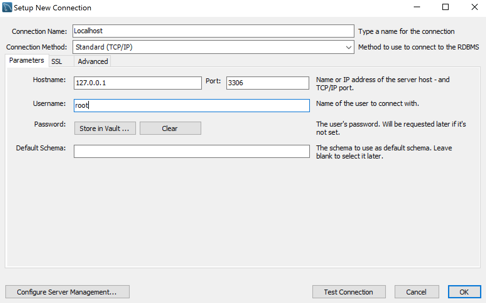

## 8.1 Lesson Plan - Install MySQL

### Overview

During this lecture, most of class will center on project work.

## Instructor Priorities

* Students should have the entirety of class to work on their projects.

* Make sure your students make measurable progress with their project work.

* Asks students to confirm their MySQL installation with TAs.

## Instructor Notes

Today's class is primarily a project work day. However, this is a great time to have students verify their MySQL installation. The MySQL installation process is prone to error, so checking it early will set up the class for success when they reach the SQL unit.

### 1. Everyone Do: Install MySQL Workbench (0:15)

* Announce to the class that, in order to code in MySQL, they will require a coding environment other than that of Visual Studio Code.

* **Important** Alert students to download **MySQL Community Server 5.7** as the most recent release of version 8 will cause issues. Students with a Mac should not use `brew install` due to [versioning issues](https://stackoverflow.com/questions/50126503/homebrew-mysql-8-support)

* Again, alert students to download **5.7** and not **8**.

  * Let the class know that there are plenty of issues that may arise when installing and using MySQL for the first time on their computer. Tell them not to worry for the time being as time will be given to troubleshoot whatever problems they may encounter.

* Slack out the guides for students to download and install for their  OS

  * [Mac OS](Activities/01-Installation/mac_installation.md)

  * [Windows](Activities/01-Installation/pc_installation.md)

* **Mac OS**

  * Download **MySQL Community Server 5.7** from [MySQL Server](https://dev.mysql.com/downloads/mysql/5.7.html#downloads) choosing the DMG option.

  * Follow the installation [instructions](https://dev.mysql.com/doc/refman/5.7/en/osx-installation-pkg.html).

  * During setup, a temporary password will be generated. Be sure to record this as you will need it in the next steps.

  

  * Once the download is complete, open the terminal and run `mysql -u root -p`. Enter the temp password at the prompt that follows. If everything works, your terminal will now be in the MySQL Command Line Interface (or, CLI).

  * Next step is to change the temp password to a personal password. From the MySQL CLI, run the command `ALTER USER 'root'@'localhost' IDENTIFIED BY '<your new password>';` Where `<your new password>` is your newly created password.

  * Finally check the new password by exiting mysql CLI  with `exit` then startup the mysql CLI again with `mysql -u root -p`. Login using the newly created password to confirm the change.

  * Remember to record the new password you created for future use.

* **MySQL Workbench for Mac**

  * Download [MySQL Workbench](https://www.mysql.com/products/workbench/).

  * Once the download has finished open the installer and run through the installation. This process should be more straightforward as opposed the server.

  * Open up MySQL Workbench after installation.

* **PC**

  * Download the MySQL installer from [here](https://dev.mysql.com/downloads/windows/installer/5.7.html) and be sure to choose the larger of the two options.

    

  * After the download has finished open and run the installer.

  * Agree to license then select **Developer Default** as the type of setup and click next.

    

  * Continue clicking to accept the default prompts and finish the installation. At the installation screen, click `execute`. This will take a some time while it downloads and installs the necessary programs.

    

  * If you come across the error `One or more product requirements have not been satisfied`, click yes to continue.

  * Once everything has been installed you will be directed the next part of the setup. Keep everything default as you continue through the next two steps.

    

  * Next you will be at the **Accounts and Roles** page. create a root password for MySQL that you will remember. This will be used to connect your MySQL server locally and will cause issues if you forgot. So be sure record this down somewhere.

    

  * Continue through the rest of the installation using the default settings. Once everything has finished, the MySQL Shell and MySQL Workbench will open. Close out of the shell and keep the workbench open.

* Make sure that everyone has MySQL Workbench installed and booted up before continuing the lesson.

  * Again, let the class know that there are plenty of issues that may arise when installing and using MySQL for the first time. Ask that they work with a TA to resolve any errors.

* Once a majority of the class has MySQL working continue. Have any students that were not able to successfully install MySQL look on with a student who has. Encourage these students to utilize time this week to work with one of the TAs debug.

### 2. Instructor Do: Create a Localhost Connection Demo (0:10)

* Explain to the class how, since there is currently no defined server for them to connect to, they are first going to set up something called a "localhost connection" to connect to instead.

  * This type of connection allows users to create locally stored data on their computers as if they were an external server.

  * This is a much better alternative to spending hundreds to thousands of dollars on buying a physical server for the purposes of practicing on.

* Open up MySQL Workbench and click the (+) symbol next to the text which reads "MySQL Connections"

  * Enter "Local Instance MySQL" as the connection name

  * Make sure the connection is set to "Standard (TCP/IP)"

  * Enter "localhost" as the Hostname

  * Enter "3306" as the port for this connection. It is possible to leave this part out of the connection and still have a working instance. That is because MySQL uses port 3306 by default.

  * Enter your MySQL username into the Username section (Default is "root")

  * Click on the **Store In Vault...** button beside the Password option and enter in your MySQL password (Default is empty)

    * Mac users will see **Store in Key chain** instead

  * Leave the Default Schema field empty

    

* Click on the "Test Connection" button so as to ensure the new localhost connection was created correctly. If successful, hit okay and the new connection should appear on the main page.

  * Now double-click on that connection, enter your password if necessary, and the SQL editor will appear.

* Check to see if there are any questions and answer them as accurately as possible before moving onto the next activity.

### 3. Students Do: Create a Localhost Connection (0:20)

* Let the class know that MySQL Workbench can sometimes seem a little hard to comprehend when loaded up for the first time and that confusion is perfectly normal.

  * Students who have successfully created a localhost connection should be encouraged to help those who seem to be struggling, especially if they happened upon the same kind of error that the struggling student is having.

  * If students feel they cannot help their fellow students, have them start reading up on how databases are created and used in MySQL.

  

* **Instructions**:

  * Now it is your turn to set up a localhost connection! This may seem as if it will be an easy task, but there are some common errors and hurdles that might stand in your way as you work to create your first ever MySQL connection.

  * Start out by opening up MySQL Workbench and hitting the (+) button next to the text which reads "MySQL Connections". Sequel Pro will also have a (+) on the bottom left for new connections.

  * Enter the following credentials into the on-screen prompt...

    * Connection Name: Local Instance MySQL

    * Connection Method: Standard (TCP/IP)

    * Hostname: localhost

    * Port: 3306

    * Username: <Your MySQL Username> (Defaults to "root")

    * Password: <Your MySQL Password> (Defaults to empty)

    * Keep the Default Schema field empty

  * Hit "Test Connection" and, if the connection is successful, hit okay and double-click on the newly created field under the "MySQL Connections" text on the home page

* Ask students to reach out to a TA if their connection fails. Encourage them to search online for answers too.

  * One of the best first steps when dealing with MySQL connection problems is to uninstall/reinstall MySQL Server using the MySQL Installer. For whatever reason, MySQL Server does not always seem to work properly when installed alongside MySQL Workbench and might function properly if reinstalled individually.

  * If your connection was successful and you have nothing else to do, feel free to help those around you in creating their connections.

* **Bonus**:

  * Look into how you can create and use databases using SQL commands

  * Look into the reasons why MySQL uses port 3306 as its default

### 5. Students Do: Project Work (2:15)

* Students have the rest of class time to work on their projects.
